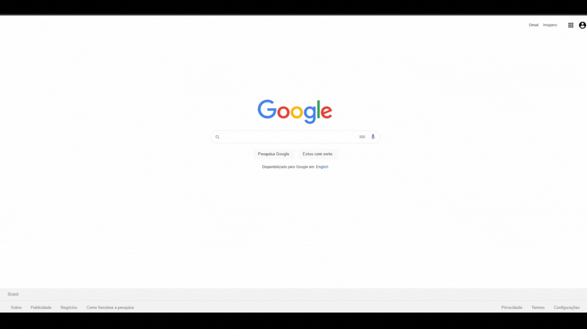

<h1 align="center">
    
</h1>

<h1>
    
</h1>

## 👀 Sobre

Exercício de reprodução da página inicial de buscas do Google. 

---

## 🛠 Tecnologias utilizadas

O projeto foi desenvolvido utilizando as seguintes tecnologias

- Html
- Css

---

## 💡 Como baixar o projeto

```bash

    # Clonar o repositório
    $ git clone https://github.com/pedrow42/google-search

    ## Entrar no diretório
    $ cd google-search/html

    ## Inicie o sistema
      index.html
```
